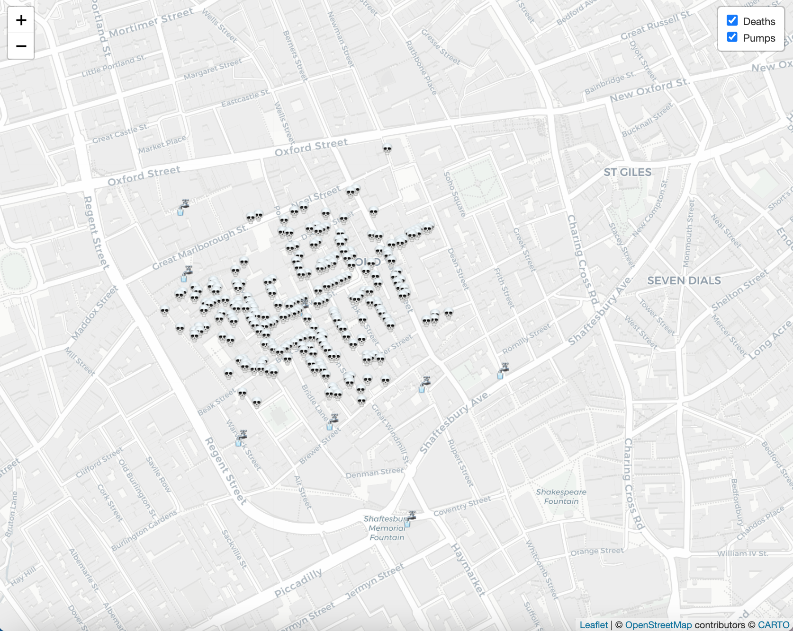

# El mapa del cólera que transformó el mundo: el periodismo de datos de John Snow
  


# Resumen
Este proyecto ofrece una visualización en R del brote de cólera en el barrio de Soho, en Londres, realizado por John Snow. Destaca la importancia del periodismo de datos y el análisis espacial para comprender y combatir enfermedades infecciosas.

# Antecedentes
El brote de cólera en Broad Street, Londres, en 1854, fue un evento crucial estudiado por John Snow. Mediante técnicas de mapeo de datos, Snow rastreó los casos y descubrió una concentración de infecciones en torno a una bomba de agua en Broad Street. Su análisis reveló un patrón claro de propagación del cólera relacionado con la calidad del agua, lo que proporcionó ideas clave sobre la transmisión de enfermedades infecciosas. El trabajo de Snow sentó las bases de la investigación epidemiológica moderna y motivó reformas en las prácticas de salud pública, especialmente en lo referente al saneamiento y los sistemas de suministro de agua.


``` r

# Cargar librerías necesarias
library(leaflet)
library(isdas)
```
``` r
# Cargar los datos de muertes y bombas de agua
data("snow_deaths")
data("snow_pumps")
```
``` r
# Cargar los datos de muertes y bombas de agua
death_icon <- makeIcon(
  iconUrl = "https://emojicdn.elk.sh/💀",
  iconWidth = 15, iconHeight = 15
)
# Definir el icono personalizado para "Bombas de Agua"
pump_icon <- makeIcon(
  iconUrl = "https://emojicdn.elk.sh/🚰",
  iconWidth = 20, iconHeight = 20
)
```
``` r
# Crear un mapa interactivo
snow_map <- leaflet() |>
  # Configurar la vista inicial del mapa
  setView(lng = -0.136, lat = 51.513, zoom = 16) |>
  # Cambiar el estilo del mapa a tonos grises
  addProviderTiles("CartoDB.Positron") |>
  # Agregar marcadores de muertes con el icono personalizado
  addMarkers(data = snow_deaths, ~long, ~lat,
             icon = death_icon,
             group = "Deaths" ) |>
  # Agregar marcadores de bombas de agua con el icono personalizado
  addMarkers(data = snow_pumps, ~long, ~lat,
             icon = pump_icon,
             group = "Pumps" ) |>
  # ñadir control de capas para alternar entre muertes y bombas de agua
  addLayersControl(overlayGroups = c("Deaths", "Pumps"),
                   options = layersControlOptions(collapsed = FALSE))
```
``` r


  # Mostrar el mapa interactivo
  snow_map
```


